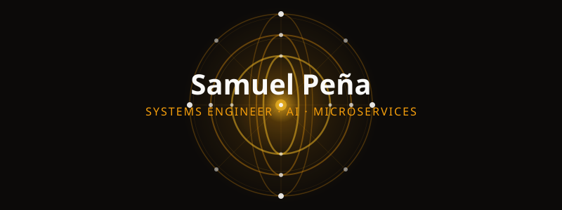

<!-- Header: Celestial Thrones (Ophanim) -->

 

  
  
  
  
  

---

## About Me

Systems Engineering student passionate about **artificial intelligence**, **scalable architectures**, and **intelligent systems**.

I build software solutions that transform data into powerful tools for decision-making, automation, and user-centered experiences.

---
